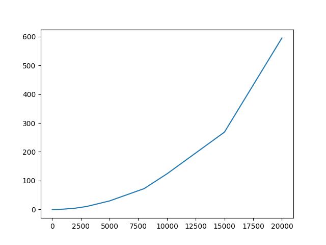
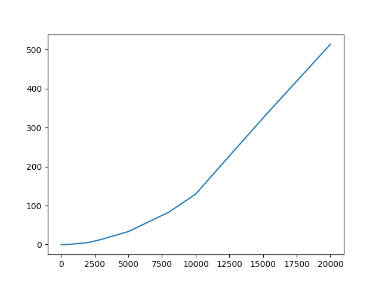
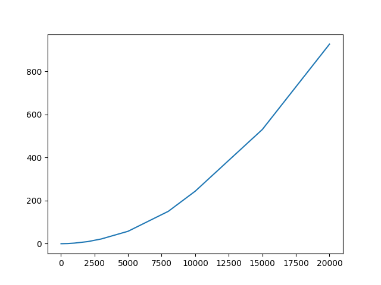

Mussard Wassim - 28706762   
Hached Cynthia - 3702042

# LU3IN003 - Sorbonne Université 

## **Projet : Alignement de séquences**    

### **2 . Le problème d'alignement de séquences** 

**Q.1 :**

Supposons que  ($\bar{x}$,$\bar{y}$) et  ($\bar{u}$,$\bar{v}$) sont respectivement des alignements de $(x,y)$ et $(u,v)$ alors les conditions ci-après sont vérifiées : 

1. $\pi(\bar{x}) = x$
2. $\pi(\bar{y}) = y$
3. $\pi(\bar{u}) = u$
4. $\pi(\bar{v}) = v$
5. $|\bar{x}| = |\bar{y}|$
6. $|\bar{u}| = |\bar{v}|$
7. $\forall i \in [1...|\bar{x}|],\bar{x}_i \neq  -$ ou $\bar{y}_i \neq -$
8. $\forall i \in [1...|\bar{u}|],\bar{u}_i \neq  -$ ou $\bar{v}_i \neq -$

Donc la concaténation $(x.u,y.v)$ doit produire  un alignement respectant  les conditions :     
        
 $\bullet$ $\pi(\bar{x}.\bar{u}) = x.u$ ce qui est vérifié avec (1) et (3).     
 $\bullet$ $\pi(\bar{y}.\bar{v}) = y.v$ ce qui est vérifié avec (2) et (4).     
$\bullet$ $|\bar{x}.\bar{v}|$  = $|\bar{y}.\bar{v}|$ ce qui est vérifié avec (5) et (6)         
$\bullet$ $\forall{i} \in [1...|\bar{x}.\bar{u}|]$,$(\bar{x}.\bar{u})_i \neq -$ ou $(\bar{y}.\bar{v})_i \neq -$ ce qui est vérifié avec (7) et (8).     

**Q.2 :** 

Soit ($\bar{x}$,$\bar{y}$) un alignement de (x,y) alors la longueur maximale de l'alignement serait de $(m+n)-1$.       

**Exemples :**  

Soit $x = AAAA$ et $y = BB$ alors la taille max serait de $6$, avec :    
$\bar{x}=AAAA--$  et  $\bar{y}$ $= ----BB$.     

### **3. Algorithmes pour alignement de séquences** 

**Q.3 :**

Pour un mot $x$ de longueur $n$ , il y a  $\binom{|n|+k}{k}$ mots possibles .   

**Exemples :**  

$\bullet$ Prenons *x = A* de longeur $n =1$ et avec $k = 2$ gaps ajoutés, on obtient :    
$\bar{x}$ : {$A--, -A-, --A$}   
$\bar{x} = n+k = 3$     
$\frac{3!}{2!.1!} = \frac{6}{2}=3$   

$\bullet$ Prenons $y = AA$ de longeur $n = 2$ et avec $k = 2$ gaps ajoutés , on obtient :       
$\bar{y}$ : {$AA--,A-A-,-AA-,-A-A,--AA$}        
$|\bar{y}| = n+ k = 3$  
$\frac{4!}{2!.2!} = \frac{24}{4}=6$

**Q.4 :**            
En ajoutant $k$ gaps à $x$  pour obtenir un mot  $\bar{x}$ , on aura  **(k +(|x|-|y|))** gaps ajoutés à $y$ .     
Il y a $\frac{(m+|\bar{x}|-|y|)!}{(|\bar{x}|-|y|)!m!}$ façons d'insérer ces gaps dans $y$ .     
Pour connaître le nombre d'alignements possibles de $(x,y)$, on distingue $3$ cas :

$\bullet$ Si **m** = **k** alors il y aura $k$ parmi $(n+k)$ mot d'alignements possibles de $(x,y)$     
$\bullet$ Si **n** = **m > k**  alors il y aura **(k$\times$n)** alignements possibles de $(x,y)$       
$\bullet$ Si **k $\geq$ n $>$m** alors il y aura $0$ alignement possible de $(x,y)$

**Q.5 :**  
a) La complexité temporelle  pour énumérer les alignements et de  trouver la distance d'édition serait en **$O(l*n)$** où $n$ est le nombre d'alignements de $(x,y)$. (On fait $n$ itérations pour énumérer les $n$ alignements et on parcourt nos alignements de taille $l$  pour chaque alignements.  
b) La complextié temporelle qui consisite à énumérer les alignements et de trouver le coût minimal serait en **$O(k+n)$** , où k serait la complexité nous permettant d'énumérer + calculer les distances d'édition et n le nombre de coût à regarder/comparer pour trouver le minimum . Soit une complexité en
 **$O(n+ln+n)$ = $O(2n+l*n)$**

**Q.6 :**       
a) La complexité spatiale d'un algorithme qui consisterait à énumérer tous les alignements de deux mots en vue d trouver la distance d'édition serait en **$O(n+m)$** où **n** représente les **n** alignements et **m** les **m** coûts pour chaque alignements.       
b) La complextié spatiale qui consisite à énumérer les alignements et de trouver le coût minimal serait en **$O(n+m)$**  également avec une liste d'adjacence où on ferait le *min* pour chaque alignements , pour récupérer le coût minimal.

### **Tâche A :**        

$\bullet$ Les fichiers utilisée sont  **tacheA.py** avec son fichier test  **testTacheA.py** avec les fichiers     `test.txt` et `test2.txt`

$\bullet$ Le temps de consommation mémoire nécessaire est de : **$0.4$%** du CPU .      

### **3.2 Programmation dynamique**

**Q.7 :**       
$\bullet$ si $u_l’$ $= -$  alors $v_l$ $\neq -$ .   (par définition)    
$\bullet$ $v_l’$  = - alors $u_l’$ $\neq -$ . (par définiton)   
$\bullet$ si $v_l’$  $\neq -$ et $u_l’$ $\neq -$  alors  $u_l’$ = $x$ , $y_l’$ = y où $x,y$ appartient à $E$ . ($E$ $=$ {$A,T,C,G$} ) . 
  
**Q.8 :**       
$\bullet$ si $u_l’ = -$ alors $v_l’$ $\neq-$ , donc  $C(u’,v’) = C(u’[1..l-1],v’[1..l-1]) + Cins$ .     
$\bullet$ si $v_l’ = -$ alors $u_l’ \neq -$ , donc $C(u',v') = C(u'[1 .. l-1],v'[1 ..l-1]) + Cdel$ .    
$\bullet$ si $v_l’ \neq -$ et $u_l’ \neq -$  on aura $C(u',v') = C(u'[1 .. l-1],v'[1 ..l-1])  + Csub(x[l],y[l])$.   

**Q.9 :**   
D'après la question 7 , on retrouve trois  possibilités pour $(\bar{u}_l,\bar{v}_l)$ : $(x_{[i]},-)$,$(-,y_{[j]})$ et $(x_{[i]},y_{[j]})$ . Pour $(x_{[i]},-)$, on va devoir modifier les $j$ caractères, de $y$ à $i-1$ caractères de $x$ . Ainsi, on obtient l'expression suivante : $D(i,j) = D(i-1,j)+c_{del}$. A l 'inverse , avec $(-,y_{[j]})$  où cette fois ci on va changer les les $i$ caractères, de $x$ à $j-1$ caractères de $y$ .On obtient alors : $D(i,j) = D(i,j-1)+c_{ins}$. Enfin, pour $(x_{[i]},y_{[j]})$, on devra simplement faire la substitution des $i'$ et $j'$ caractères tel que $i' < i$ et $j' < j$ , ce qui nous donne :  $D(i,j) = D(i-1,j-1)+c_{sub}$ . Au final on prendra donc le :  $min{(D(i,j) = D(i-1,j)+c_{del},D(i,j) = D(i,j-1)+c_{ins},D(i,j) = D(i-1,j-1)+c_{sub})}$ car on  veut la distnce minimale .   
**Q.10 :**  
$D(0,0) = 0$, car les mots $x$ et $y$ sont vides .      
**Q.11 :**      
$D(0,j) = j*c_{ins}$, car on a $i = 0$ donc $i$ est un mot vide .      
$D(i,0) = i*c_{del}$, de même ici, car $j = 0$ donc $j$ est un mot vide .

**Q.12 :**         
Pseudo code d'un algorithme  **itératif** nommé **DIST_1** :    

        DIST_1
                Entrée : x et y deux mots 
                   i un indice de [1..n]
                   j un indice dans [1..m]
                   T un tableau à deux dimensions 
                   D la distance d'édition en x[1..i] et y[1..j]
                Sortie : d la distance d'édition entre x et y 
                tailleX <- taille(x)
                tailleY <- taille(y)
                Déclarer et initialiser un tableau T de taille tailleX par tailleY à zéro
                Pour i allant de 0 à tailleX+1 faire : ## réponse à la question 11
                  T[i,0] <- i*c_del
                Pour j allant de 0 à tailleY+1 faire : ## réponse à la question 11
                  T[0,j] <- j*c_ins
                Pour i allant de 1 à tailleX+1 faire :
                  Pour j allant de 1 à tailleY+1 faire : ## réponse à la question 7
                   T[i][j]<-min(T[i-1][j]+c_del,T[i-1][j-1]+sub(x[i-1],y[j-1]),T[i][j-1]+c_ins)
        Retourner (T[tailleX-1][tailleY-1])

**Q.13 :**  

La structure utilsée est un tableau à deux dimension de taille $n *m$ donc la complexité spatiale de **DIST_1** est en $O(n*m)$    

**Q.14 :** 

La complexité temporelle de **DIST_1** est en $O(n*m)$. En effet , on a l'imbrication des deux boucles qui nous donne une complexité en $O(n*m)$ .

**Q.15 :**              

Si $D(i,j)=D(i-1,j-1)+C_{sub}(x_{i},y_{j})$  alors  $x_{i}\neq -$  et  $y_{i} \neq -$   
Soit un couple $(\bar{s},\bar{t})$ $\in$ $Al$*$(i-1,j-1)$ alors $(\bar{s}.x_{i},\bar{t}.y_{j}) = (\bar{s},\bar{t}) + d(x_{i},y_{j})$  avec  $(\bar{s}.x_{i},\bar{t}.y_{j}) \in$ Al\*$(i,j)$.       
Donc $\forall (\bar{s},\bar{t}) \in$ Al\* $(i-1,j-1)$ , $(\bar{s}.x_{i},\bar{t}.y_{j}) \in$ Al\*$(i,j)$ .

**Q.16 :**      
*L'idée ici, c'est de remonter dans notre tableau T pour 'créer' le chemin optimal. On va donc faire l'opération inverse de DIST_1.*    
Pseudo code d'un algorithme **itératif** nommé  **SOL_1** :     
        
        SOL_1
                Entrée : x , y deux mots 
                   T un tableau contenant toutes les valeurs de D
                Sortie : l'alignement minimal de (x,y)
                i <- taille(x)
                j <- taille(y)
                align1 <- ""
                align2 <- ""
                Tant que i != 0 et j != 0 faire : 
                   Si T[i][j] = T[i-1][j-1]+sub(x[i-1],y[j-1]) alors: ##Diagonale haut gauche
                        align1 <- align1 + x[i-1]
                        align2 <- align2 + y[j-1]
                        i <- i-1
                        j <- j-1
                   Sinon 
                        Si T[i][j] = T[i][j-1]+c_ins alors ##Déplacement vers la gauche 
                                align1 <- align1 + '-'
                                align2 <- y[j-1]
                                j <- j-1
                        Sinon ##Déplacement  vers le haut 
                                align1 <- align1 + x[i-1]
                                align2 <- align2 + '-'
                                i <- i-1
        align1 <- Inverser(align1)
        align2 <- Inverser(align2)
        retourner (align1,align2)       

        
**Q.17 :**      

En combinant les algorithmes **DIST_1** et **SOL_1**, on a une complexité temporelle en $O(n^2)$.

**Q.18 :**      

En combinant les algorithmes **DIST_1** et **SOL_1**, on a une complexité spatiale en $O(nm)$.  

### **Tâche B :**       
$\bullet$ Les fichiers utilisée sont  **tacheB.py** avec son fichier test  **testTacheB.py**     
      

        
        Courbe de consommation de temps de CPU  en fonction de la taille |x|.
        
$\bullet$ On remarque que la courbe semble être une courbe représentant **une complexité quadratique**, on est donc bien en $O(n^2)$. 

$\bullet$ La quantité de mémoire utilisée est de de **$35$%** de consommation mémoire pour une taille d'instance égale à $20000$.

**Q.19 :**      

Il nous suffirait d'avoir accès aux lignes $i-1$ et $i$ du tableau car pour trouver $T[i][j]$, on va regarder le **minimum**
entre $T[i-1][j-1]+c_{sub}$ , $T[i-1][j]+c_{del}$ et $T[i][j-1]+c_{ins}$. Ainsi, on remarque qu'on a uniquement besoin de trois cases du tableau pour trouver  $T[i][j]$.       

**Q.20 :**      

Pseudo code d'un algorithme **itératif** nommé **DIST_2** : 

        DIST_2
         Entrée : x et y deux mots 
         Sortie : renvoie la distance d'édition entre x et y 
         tailleX <- 2
         tailleY <- taille(y)
         Declarer et initialiser un tableau T  de taille taille(x) par taille(y)  à zéro
         Declarer et initialiser un tableau T_tmp de taille tailleX par tailleY à zéro
         Pour i allant de 0 à tailleX faire :
          T_tmp[i][0] <- i*c_del
         Pour j allant de 0 à taillY+1 faire :
          T_tmp[0][j] <- j*c_ins
         T[0] <- T_tmp[0]
         Pour i allant de 1 à taille(x)+1 faire :
          Pour j allant de 1 à tailleY+1 faire :
           Si i%2=0 alors : ## On regarde sur quelle ligne on est 
            k <- 0
            T_tmp[k][0] <- i*c_del
            T_tmp[k][j] <- min(T_tmp[k+1][j]+c_del,T_tmp[k+1][j-1]+sub(x[i-1],y[j-1]),
                                 T_tmp[k][j-1]+c_ins) ##Opérations inverses
           Sinon : ## On est sur la deuxième  ligne
            k <- 1
            T_tmp[k][0] <- i*c_ins
            T_tmp[k][j] <- min(T_tmp[k-1][j]+c_del,T_tmp[k-1][j-1]+sub(x[i-1],y[j-1]),
                                 T_tmp[k][j-1]+c_ins)
	  T[i]<-T_tmp[k] ## On affecte la ligne courante à T
          Si k=1 alors :  ## On écrase la première ligne par la deuxième
           T_tmp[k-1] <- T_tmp[k]
        Retourner (T[taille(x)-1,taille(y)-1])

### **Tâche C :**
$\bullet$ Les fichiers utilisée sont  **tacheC.py** avec son fichier test  **testTacheC.py**          

        Courbe de consommation de temps de CPU  en fonction de la taille |x|.

$\bullet$ On remarque que la courbe obtenue est bien en $O(n^2)$ . Ce qui semble logique, puisqu'on a juste modifié la complexité spatiale et non temporelle. Par conséquent, la courbe obtenue pour la tâcheC est assez similaire avec la courbe de la tâcheB.      

$\bullet$ On remarque également que la quantité de mémoire utilisée pour une taille d'instance de taille égale à $20 000$ est de  **$35.1$%** tout comme **DIST_1** mais **DIST_1** commençait directement à **$35$%** alors que pour **DIST_2** la quantité de mémoire utilisée augmentait en fonction temps.

### **3.4 Amélioration de la complexité spatiale du calcul d'un alignement optimal par la méthode "diviser pour régner"**       

**Q.21 :**

Pseudo code de la fonction **mot_gaps** 

        mot_gaps
                Entrée : x un mot , k un entier 
                Sortie : str contenant x constitué de k gaps
                str <- x
                Pour i allant de 0 à k faire :
                        str <- str + '-'
        Retourner str

**Q.22 :**      

Pseudo code de la fonction **align_lettre_mot** :   

        align_lettre_mot 
           Entrée : x un mot , l la longeur de x , y un mot non vide de longeur quelconque 
           Sortie : (u,v) le meilleur alignement de (x,y)
           Pour i allant de 0 à l faire : 
              Pour j allant de 0 à taille(y) faire :
                 Si x[i] = y[j] alors : ##Si les deux caractères sont égaux
                    t <- 0  ## On prend un compteur
                    Tant que t <  i-j faire : ##Compteur doit être inférieur à i-1
                       Pour k allant de j  à  i-t-1 faire : 
                          v[k] <- '-' ##Met toutes les cases en j et i-t-1 à gaps
                          t <- t+1
                    v[i] <- y[j]
                 Sinon : 
                   v[i] <- y[i]
              u[i] <- x[i]
           Si i < j alors :  ##Complète les cases restantes de x avec des gaps         
              Pour k allant de i à j faire : 
                 u[i] <- '-'
        Retourner (u,v)

**Q.23 :**      

Prenons $x$ = *BALLON* et $y$ = *ROND*. On coupe $x$ et $y$ en leurs milieux : $x^1$ = *BAL*, $x^2$ = *LON*, $y^1$ = *RO* et $y^2$ = *ND*. On obtient $(\bar{s},\bar{t})$ : *(BAL,RO-)* l'alignement optimal de $(x^1,y^1)$ et $(\bar{u},\bar{v})$ : *(LON-,--ND)* l'alignement optimal de $(x^2,y^2)$. Noius avons, $(\bar{s}.\bar{u},\bar{t}.\bar{v})$ : *(BALLON-,RO--OND)* avec $d(x,y)$ = $18$.    

**Q.24 :**      

Pseudo code de la fonction **SOL_2** ( concatenation((x,y),(u,v)) -> (x.u,y.v) )    

        SOL_2
                Entrée : x et y deux mots 
                Sortie : retourne l'alignement minimal de (x,y)
        n <- taille(x)
        m <- taille(y)
        p <- n//2 ## p <=> i*
        DIST_1(x,y) ##Met à jour T , contenant toutes les valeurs de D   
        Si n=0 et que m=0 alors : ##Cas de base 1
           Retourner ("","")
        Si n=0 et que m >= 1 alors : ##Cas de base 2
           Retourner (m*'-',y)
        Si m=0 et que n >= 1 alors : ##Cas de base 3
           Retourner (x,n*'-')
        Si n=1 et que m=1 alors : ##Cas de base 4
           Retourner (x,y)
        Si n=1 et que m!=1 alors : ##Eviter une RecursionError car on aura p = n//2 = 1//2 = 0
           d <- m-n
           Retourner(x+d*'-',y)
        c <- coupure(x,y,T)
        Retourner concatenation(SOL_2(x[0:p],y[0:c]),SOL_2(x[p:n],y[c:m]))

**Q.25 :**

Pseudo code de la fonction **coupure** :        

        coupure 
                Entrée : x et y deux mots , T un tableau contenant toutes les valeurs de D
                Sortie : retourne j* l'indice de coupure de (x,y) associé à i*
        i <- taille(x)
        j <- taille(y)
        p <- taille(x)//2 ##  p <=> i*
        Tant que i != p et que j!=0 faire : 
        ##Remonte T en prenant le chemin optimal jusqu'à couper i*
                SiT[i][j] = T[i-1][j-1]+sub(x[i-1],y[j-1] alors :
                        i <- i-1
                        j <- j-1
                Sinon : 
                        Si T[i][j] = T[i][j-1]+c_ins alors :
                                j <- j-1
                        Sinon : 
                                i <- i-1
        Retourner j     

**Q.26 :**      

La complexité spatiale de **coupure** est en $O(n*m)$. En effet , il divise la première séquence en deux puis cherche le résidu de la deuxième séquence qui permet d'optimiser les deux alignements.    

**Q.27 :**      

La complexité spatiale de **SOL_2** est en $O(min(n,m))$, puisqu'on parcourt  la séquence la plus petite des deux .     

**Q.28 :**      
A chaque appel à **coupure** , notre fonction va dans le pire cas effectuer **i\*** tour de boucle où $i$\* $= \lfloor{\frac{|x|}{2}}\rfloor$ . On en déduit donc que **coupure(x,y,T)** $\in O(log_n)$ 

### **Tâche D :**       
$\bullet$ Les fichiers utilisée sont  **tacheD.py** avec son fichier test  **testTacheD.py**      
        
        Courbe de consommation de temps de CPU  en fonction de la taille |x|.
$\bullet$ On remarque la consommation mémoire nécessaire  au fonctionnement est d'environ de $17$% maximum , puis passe à $5$% pour une taille d'instance égale à $20000$ .

**Q.29 :**      

Nous n'avons pas perdu en complexité temprelle en améliorant la complexité spatiale. Nous avons réussi à trouver un juste équilibre entre les deux en ramenant les complexités temporelles et spatials à $O(n*m)$ 

### **4 Une extension : l'alignement local de séquences (Bonus)**       

**Q.30 :**      

En ayant $(|x|,|y|)$ le nombre de gaps ajoutés dans l'alignement global, on génère 3 instances :

        1. n=14 , m=6
          C C C C C A C A G G G C T A G
          - - - - A G A - - - C - A G       
$\bullet$ $(|x|-|y|)c_{del}$ = $(14-6)c_{del}$ = $8*c_{del}$

        2. n=20,m=7
          A A C T G T C T T T G T A G G C A C T T
          A - C T G T C T - - - - - - - - - - - -

$\bullet$ $(|x|-|y|)c_{del}$ = $(20-7)c_{del}$ = $13*c_{del}$

$\to$ $(|x|-|y|)c_{del}$ est donc vérifiée. 

